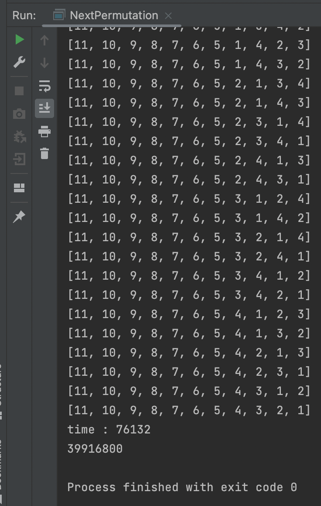
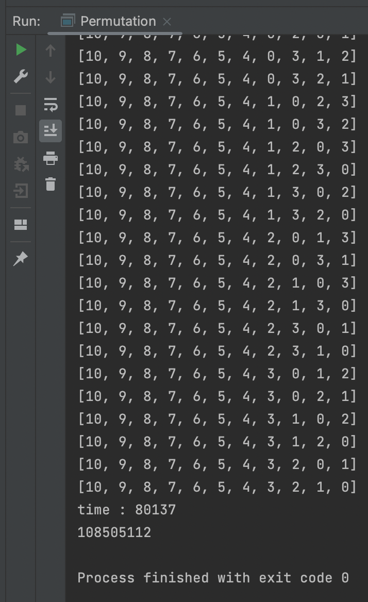

# Next Permutation

## 사전 설명

사전 순서로 다음 순열을 뽑는 알고리즘이다.
이를 이용해서 다음 순열이 없을 때까지 뽑으면서 순열을 뽑을 수 있는데 재귀를 사용하는 것보다 적은 호출로 순열을 뽑아 낼 수 있다.

단, 이를 활용해서 순열을 뽑을 경우에 전체 중에 특정 갯수만을 뽑는 순열에는 적용할 수 없다.
또한, `0`, `1`이 들어있는 배열을 사용해서 조합을 찾는데 사용할 수 있다.


## 설명

우선 내림차순으로 정렬된 것이 가장 마지막 순열이라고 보았을 때, 값들은 뒤에서부터 봤을때 모두 점점 커지고 있다.
만약, `값들이 점점 커지다가 갑자기 작아지는 부분`이 있다면 이곳이 값이 바뀌어야되는 부분이다.

바꿔야 할 부분을 찾았다면 그 값과 바꿔줄 가장 작은 값을 찾아주면 된다.

뒤에서부터 점점 커지다가 작아지는 부분을 찾았기 때문에 뒤에서부터 탐색하면서 비교할 것보다 큰 수를 찾으면 `바꿔줄 가장 작은 수를 찾을 수 있다.`

그렇게 두 값을 변경하고 나면 `나머지 부분들을 다시 오름차순으로 정렬`해주어야 바로 다음의 순열이 된다.

하지만 변경 후에도 그 뒤에 숫자들은 내림차순을 유지하고 있기 때문에 단순히 앞과 뒤를 `스왑`해주는 형식으로 정렬할 수 있다.


## 코드

``` java
import java.util.Arrays;

public class NextPermutation {
    public static void main(String[] args) throws Exception {
        int[] list = {1, 2, 3, 4, 5};

        do {
            System.out.println(Arrays.toString(list));
        } while (np(list));
    }

	static boolean np(int[] arrs) {
	    int N = arrs.length - 1;

	    //find peak location
	    int j = N;
	    while (j > 0 && arrs[j] <= arrs[j - 1]) j -= 1;
	    j -= 1;
	    //return false when already sorted
	    if (j < 0) return false;

	    //find change location
	    int k = N;
	    while (arrs[k] <= arrs[j]) k -= 1;
	    swap(arrs, j, k);
	    //sort
	    int l = N;
	    while (j < l) {
	        swap(arrs, j + 1, l);
	        j += 1;
	        l -= 1;
	    }
	    return true;
	}

    static void swap(int[] arr, int i, int j) {
        int tmp = arr[i];
        arr[i] = arr[j];
        arr[j] = tmp;
    }
}
```


## 조합 찾기

위의 코드에서 길이가 n이고 그중에 1이 r개인 배열을 사용해서 nCr을 구할 수 있다.

```java
public static void main(String[] args) throws Exception {
    int[] list = {0, 0, 0, 1, 1};

    do {
        System.out.println(Arrays.toString(list));
    } while (np(list));
}
```


## 시간 차이

1. use next-permutation

2. use recursive


시간으로는 약 5초 정도 연산 횟수로는 약 2.5배의 차이를 보인다.

## 정리
앞으로 정말 시간을 타이트하게 줄여야할 상황이 온다면 `next-permutation`을 이용해서 문제를 한번 풀어보자!
