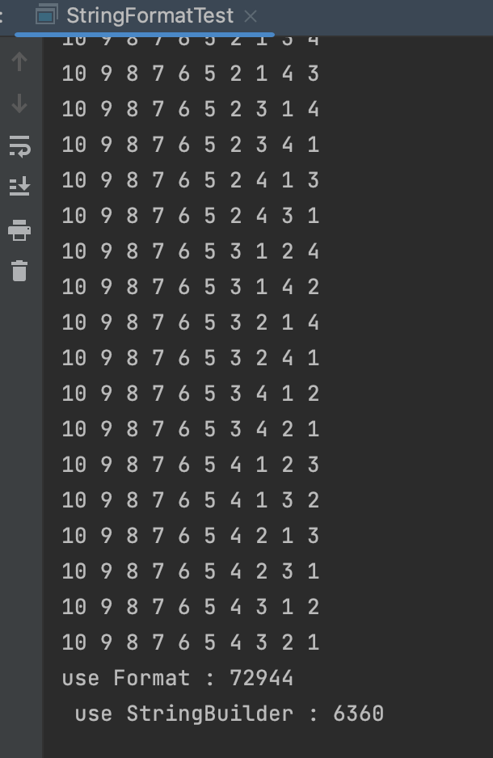

	https://www.acmicpc.net/problem/20299
	string format 방식을 사용하면 시간초과가 나는데 왜 나고 무슨 차이가 있을까?

## 문제 인식

해당 문제를 푸는데 `String Fomat` 방식을 사용해서 풀었더니 시간 초과가 발생했다.
브론즈 문제에서 별 다른 알고리즘으로 최적화하는 것은 아니라고 생각해서 문자열을 `StringBuilder`로 만들어서 합쳤더니 시간내로 들어오게 되었다.

그래서 얼마나 시간 차이가 나는지 왜 이렇게 시간 차이가 나는지 궁금해서 찾아보게 되었다.

## 테스트

`stackOverFlow`에서는 다른 방법으로 성능 테스트를 하지만 어떤 식으로 측정하는지 잘 모르겠고 댓글에 틀린 측정 방법이라는 말이 많아서 그냥 신경 안쓰고 무식하게 출력해보기로 했다.

10자리 순열을 `Next Permutation`을 이용해서 출력해볼 것이다.

결과를 보면 약 11.5배의 차이를 보이게 된다.

## 이유

`StringFormat` 내부에서 정규식을 사용해서 삽입할 위치를 찾아주고 해당 위치에 넣는 작업을 따로 수행하기 때문이였다.

## 결론

찾아보니 서버에서 로그 출력시 짧은 시간에 많은 로그를 출력할 때 문제가 발생하기도 한다고 한다.
출력이 많이 필요한 경우에는 사용을 자제하고 코테에서는 `StringBuilder`를 쓰거나 내부적으로는 똑같다고 하니 그냥 `+`를 사용해야될 것 같다.
