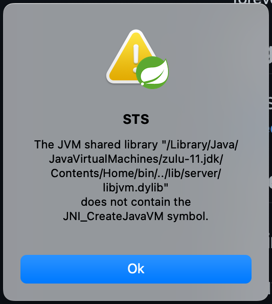
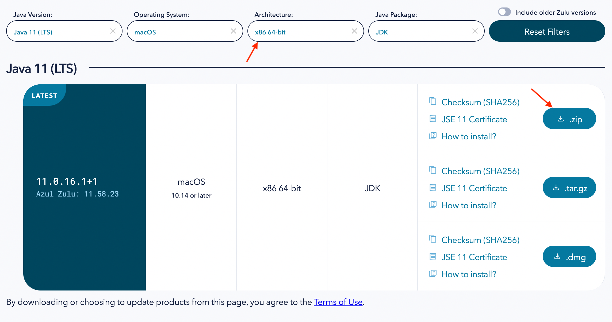
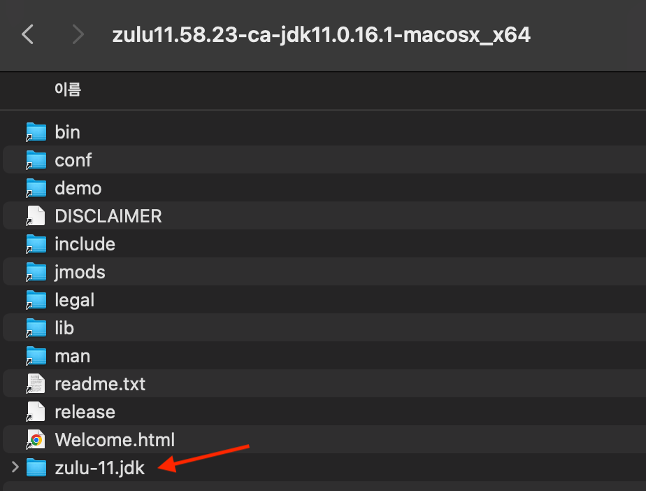
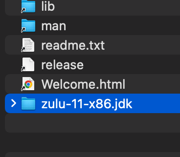
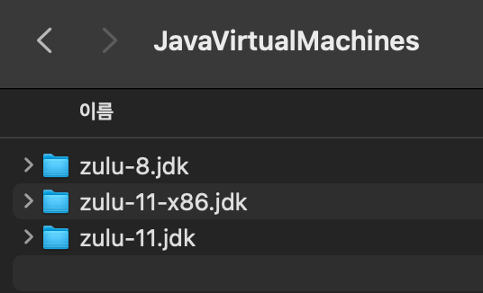
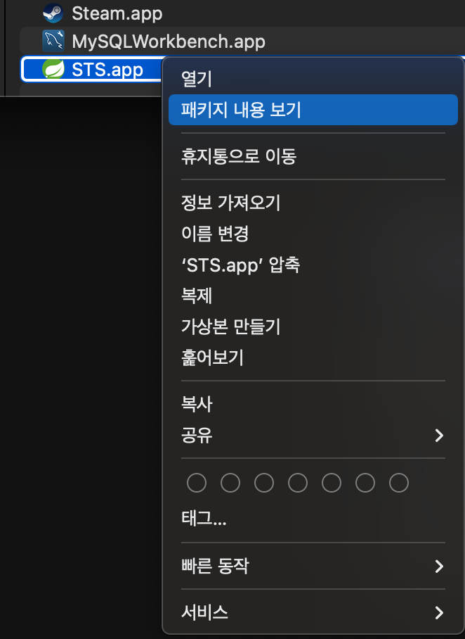
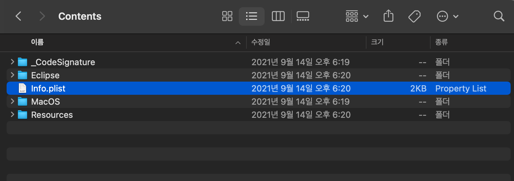
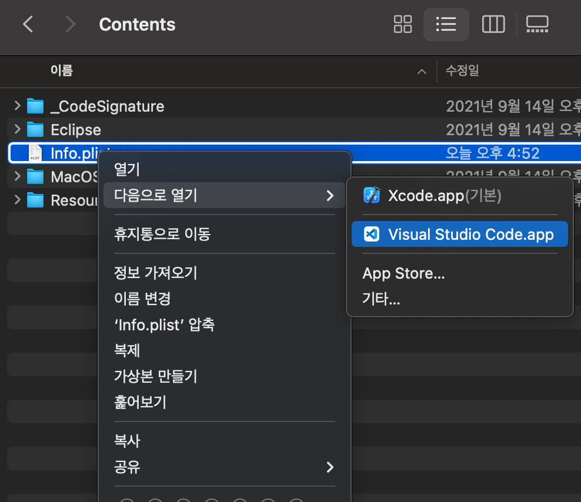
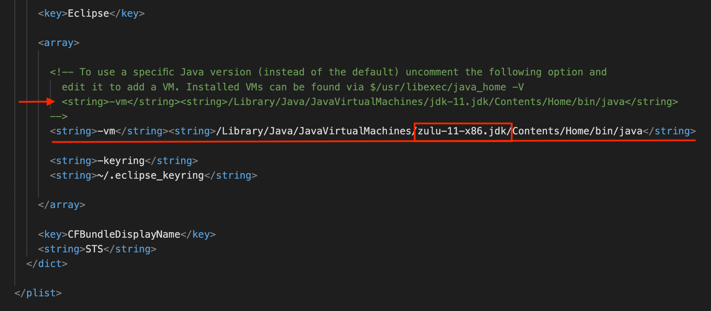
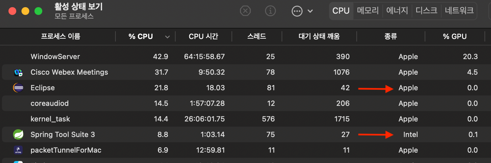

## 오류 발생

`m1 mac`에서 `STS3`를 사용할 일이 생겨서 열어보니 다음과 같은 에러를 발생시켰다.

## 원인
구글에 검색해보니깐  `ARM64 jdk`를 사용하면 오류를 발생한다고 한다.

## 해결
해결 방법을 찾아보니깐 기본 `JAVA`를 `intel JAVA`로 바꾸어서 해결했는데 나는 원래 `Intellij`를 사용하고 있기도 했고 `STS`만 `intel JAVA`를 사용하고 싶어서 찾다가 방법을 찾아서 공유하려고 한다.

### 1. intel JDK 다운
우선 `JDK11 intel` 버전이 필요함으로 다음 사이트에서 받아주는데 `zip`파일로 받아준다.

[zulu downlaod](https://www.azul.com/downloads/?package=jdk)

받은 `zip`파일을 열어주면 다음과 같이 나오는데 우리는 이중에 `zulu-11.jdk` 파일만 필요하다.

나는 이미 `zulu-11.jdk`가 있는 상태에서 진행함으로 이름을 바꾸어주었다.

	`dmg`를 사용해서 다운 받게 되면 그냥 `zulu-11.jdk` 라는 이름으로 덮어 씌우게 됨으로 이름을 바꿔주는게 좋을 것 같다.

이제 `jdk`파일을 `/Library/Java/JavaVirtualMachines` 로 옮겨준다.

`JDK` 다운은 끝!

### 2. `STS` 설정
이제 `finder`에서 `STS` 패키지 내용 보기로 연다.

`/Contents/info.plist` 를 열어서 수정을 해줘야 한다.

이때 그냥 열면 `Xcode`로 열리니깐 우클릭해서 `vscode`나 다른 편집기로 열어준다.

열어서 맨 밑을 확인하면 주석이 되어 있는 부분을 확인할 수 있는데 주석을 복붙해서 네모쳐있는 부분을 우리가 받은 `jdk`로 바꿔준다.

그리고 실행해보면 잘 실행되는 것을 볼 수 있다!

### 3. 확인
활성 상태를 확인해도 `Eclipse`는 `apple`로 `STS`는 `intel`로 실행되는 것을 볼 수 있다.

